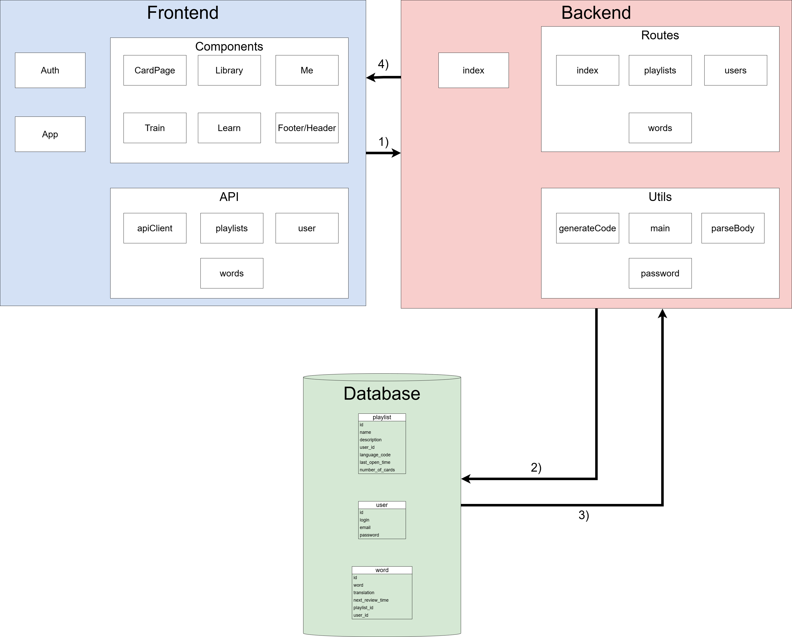
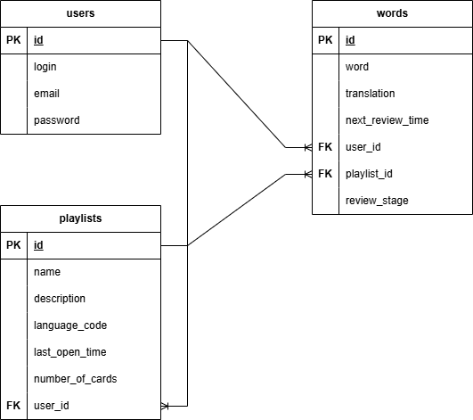

### Лабораторна робота №3: Розробка структури застосунку

#### Виконані завдання:

1. **Розроблено структуру компонентів ПЗ**:
   - Додаток поділено на три основні частини:
     - **Frontend**: Клієнтська частина, побудована на основі React.
     - **Backend**: Серверна частина, реалізована за допомогою Node.js та Express.
     - **Database**: База даних для збереження інформації про користувачів, слова та плейлисти.
   - Результат представлено у вигляді діаграми компонентів ПЗ:
     

2. **Описано дані та їх зв’язки**:
   - Розроблено ER-діаграму бази даних, яка включає три таблиці:
     - **users**: зберігає інформацію про користувачів.
     - **words**: зберігає слова, які користувач вивчає.
     - **playlists**: групує слова у плейлисти для зручності навчання.
   - ER-діаграма:
     
   - Зв’язки між таблицями:
     - `users.id → playlists.user_id (1:N)`
     - `users.id → words.user_id (1:N)`
     - `playlists.id → words.playlist_id (1:N)`

---

#### **Опис логіки та маршрутів Backend**

1. **Маршрути для `users`**:
   - **`POST /users/register`**:
     - Реєструє нового користувача.
     - Хешує пароль і зберігає дані в таблиці `users`.
     - Повертає токен авторизації.
   - **`POST /users/login`**:
     - Аутентифікує користувача за логіном і паролем.
     - Повертає токен авторизації та інформацію про користувача.
   - **`GET /users/checkAuth`**:
     - Перевіряє токен у cookie.
     - Якщо токен валідний, повертає інформацію про користувача та його плейлисти.
   - **`POST /users/logout`**:
     - Видаляє токен авторизації.
   - **`POST /users/updateUsername`**:
     - Оновлює логін користувача після перевірки токена.

2. **Маршрути для `playlists`**:
   - **`POST /playlists`**:
     - Додає новий плейлист для авторизованого користувача.
   - **`GET /playlists`**:
     - Повертає всі плейлисти авторизованого користувача.
   - **`GET /playlists/:id`**:
     - Повертає деталі конкретного плейлиста за його `id`.
   - **`DELETE /playlists/:id`**:
     - Видаляє плейлист за його `id`.
   - **`PUT /playlists/open/:id`**:
     - Оновлює час останнього відкриття плейлиста.

3. **Маршрути для `words`**:
   - **`POST /words`**:
     - Додає нове слово до бази даних, прив’язуючи його до користувача та плейлиста (за потреби).
   - **`DELETE /words/:id`**:
     - Видаляє слово за його `id`.
   - **`PUT /words/:id`**:
     - Оновлює інформацію про слово (наприклад, переклад, плейлист тощо).
   - **`PUT /words/stage/:id`**:
     - Оновлює етап навчання (`review_stage`) та час наступного повторення.

---

#### **Оновлення/зміни/агрегації даних**:

1. **Реєстрація та авторизація**:
   - **Реєстрація**: Додає нового користувача до таблиці `users`. Пароль хешується перед збереженням.
   - **Авторизація**: Після успішної перевірки логіна та пароля видає токен авторизації.

2. **Робота з плейлистами**:
   - Додавання нового плейлиста додає запис до таблиці `playlists` і автоматично прив’язує його до користувача.
   - Видалення плейлиста видаляє відповідний запис із таблиці `playlists`.

3. **Робота зі словами**:
   - Додавання нового слова додає запис до таблиці `words` і пов’язує його з користувачем та плейлистом (якщо вказано).
   - Оновлення етапу навчання змінює поля `review_stage` і `next_review_time` у таблиці `words`.

4. **Отримання даних для клієнта**:
   - Дані про користувача, плейлисти та слова агрегуються для передачі на Frontend.
   - Використовуються зв’язки між таблицями (`JOIN` у запитах) для отримання потрібної інформації.

---

#### Висновок:
- Розроблено маршрути Backend, які відповідають основним сценаріям роботи застосунку.
- Логіка роботи з даними охоплює реєстрацію, авторизацію, управління плейлистами та словами.
- Зв’язки між таблицями дозволяють агрегувати дані для зручного використання на Frontend.
