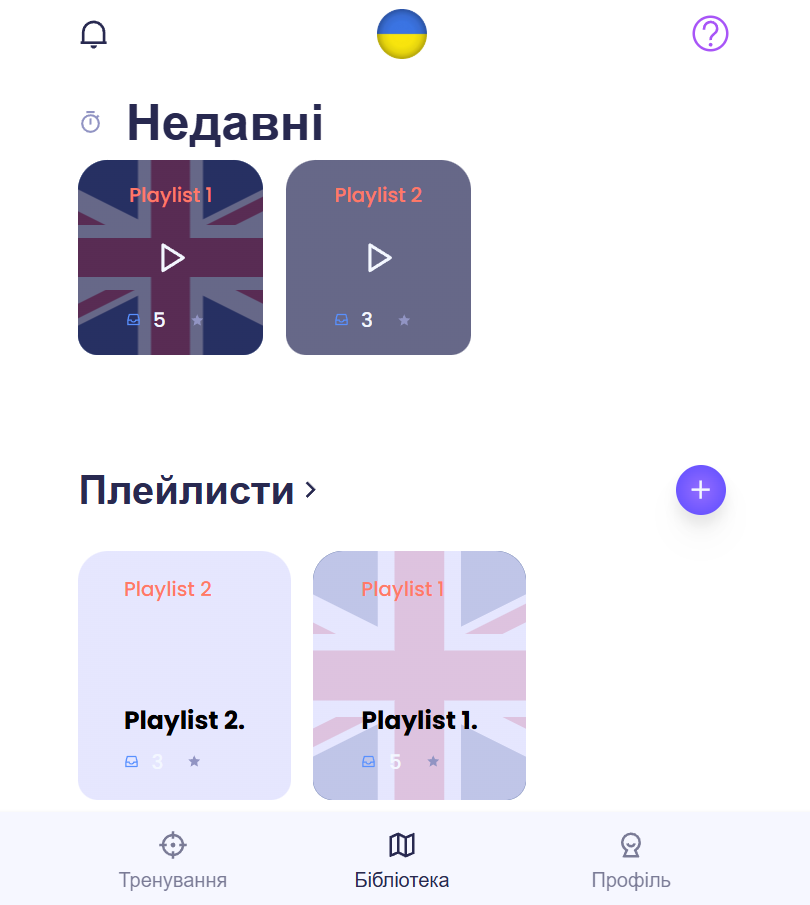

### Лабораторна робота №4: Імплементація інтерактивного прототипу

#### Виконані завдання:

1. **Реалізовано використання статичних даних на Backend**:
   - Додано mock-дані для роботи з плейлистами у файлі:
     - [backend/mockData.js](https://github.com/DenisGradov/lingo-cards/blob/lab4/backend/mockData.js)
   - Оновлено маршрути для роботи з плейлистами у файлі:
     - [backend/routes/playlists.js](https://github.com/DenisGradov/lingo-cards/blob/lab4/backend/routes/playlists.js)
   - Реалізовано основні сценарії роботи з плейлистами:
     - **Отримання всіх плейлистів**: 
       [Код: handleGetPlaylists](https://github.com/DenisGradov/lingo-cards/blob/lab4/backend/routes/playlists.js#L25)
     - **Отримання конкретного плейлиста за його `id`**: 
       [Код: handleGetPlaylistById](https://github.com/DenisGradov/lingo-cards/blob/lab4/backend/routes/playlists.js#L39)
     - **Додавання нового плейлиста**: 
       [Код: handleAddPlaylist](https://github.com/DenisGradov/lingo-cards/blob/lab4/backend/routes/playlists.js#L10)
     - **Видалення плейлиста**: 
       [Код: handleDeletePlaylist](https://github.com/DenisGradov/lingo-cards/blob/lab4/backend/routes/playlists.js#L31)
     - **Оновлення часу відкриття плейлиста**: 
       [Код: handleOpenPlaylist](https://github.com/DenisGradov/lingo-cards/blob/lab4/backend/routes/playlists.js#L52)

2. **Інтеграція Frontend із Backend**:
   - Оновлено API для роботи з плейлистами у файлі:
     - [lingo-frontend/api/playlists.js](https://github.com/DenisGradov/lingo-cards/blob/lab4/lingo-frontend/api/playlists.js)
   - Реалізовано основні функції:
     - Отримання всіх плейлистів із mock-даних.
     - Додавання нового плейлиста через API.
     - Видалення плейлиста через API.
     - Оновлення часу відкриття плейлиста через API.

3. **Оновлено компонент Library для роботи з mock-даними**:
   - Оновлено логіку у файлі:
     - [lingo-frontend/components/Library.jsx](https://github.com/DenisGradov/lingo-cards/blob/lab4/lingo-frontend/components/Library.jsx)
   - Додано функції для роботи з API:
     - Отримання плейлистів та їх відображення.
     - Видалення плейлиста.
     - Відкриття плейлиста з оновленням часу останнього відкриття.

#### Додаткові матеріали:

- **Скріншот реалізації (Frontend)**:
 

#### Висновок:

- Реалізовано інтерактивний прототип із використанням статичних даних на Backend.
- Забезпечено інтеграцію Frontend із Backend для основних сценаріїв роботи з плейлистами.
- Структура додатку дозволяє легко переключитися на використання реальної бази даних у майбутньому.
