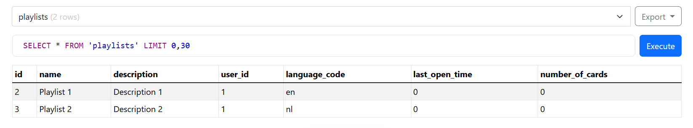
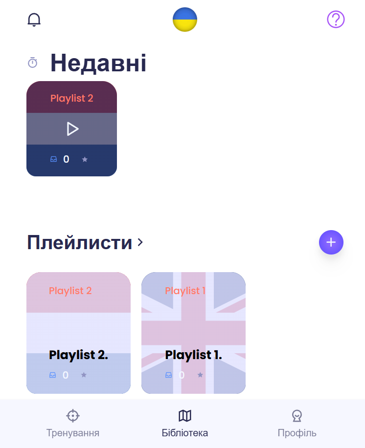

### Лабораторна робота №5: Імплементація інтеграції з віддаленими джерелами даних

#### Виконані завдання:

1. **Інтеграція з базою даних (SQLite):**
   - Реалізовано підключення до бази даних SQLite через файл `users.db`. Ініціалізація бази даних виконується у файлі [database.js](https://github.com/DenisGradov/lingo-cards/blob/main/backend/db/database.js).
   - Створено три таблиці:
     - **users**: Зберігає інформацію про користувачів.
     - **words**: Зберігає слова для вивчення.
     - **playlists**: Групує слова у списки для навчання.

   **SQL-запити для створення таблиць:**
   - [Ініціалізація бази даних у database.js](https://github.com/DenisGradov/lingo-cards/blob/main/backend/db/database.js#L27-L49)

2. **Реалізація моделі для роботи з таблицею `playlists`:**
   - У файлі [playlistModel.js](https://github.com/DenisGradov/lingo-cards/blob/main/backend/db/playlistModel.js) реалізовано функції для роботи з таблицею `playlists`:
     - **getPlaylistsByUserId**: [Отримання всіх плейлистів для конкретного користувача](https://github.com/DenisGradov/lingo-cards/blob/main/backend/db/playlistModel.js#L3-L10).
     - **getPlaylistById**: [Отримання плейлиста за його `id`](https://github.com/DenisGradov/lingo-cards/blob/main/backend/db/playlistModel.js#L12-L17).
     - **addPlaylist**: [Додавання нового плейлиста](https://github.com/DenisGradov/lingo-cards/blob/main/backend/db/playlistModel.js#L19-L33).
     - **deletePlaylistById**: [Видалення плейлиста за його `id`](https://github.com/DenisGradov/lingo-cards/blob/main/backend/db/playlistModel.js#L35-L41).
     - **updatePlaylistOpenTime**: [Оновлення часу останнього відкриття плейлиста](https://github.com/DenisGradov/lingo-cards/blob/main/backend/db/playlistModel.js#L43-L52).

3. **Інтеграція моделі з маршрутом `playlists`:**
   - У файлі [routes/playlists.js](https://github.com/DenisGradov/lingo-cards/blob/main/backend/routes/playlists.js) реалізовано маршрути для роботи з таблицею `playlists`:
     - **POST /playlists**: [Додавання нового плейлиста до БД](https://github.com/DenisGradov/lingo-cards/blob/main/backend/routes/playlists.js#L10-L23).
     - **GET /playlists**: [Отримання всіх плейлистів авторизованого користувача](https://github.com/DenisGradov/lingo-cards/blob/main/backend/routes/playlists.js#L25-L34).
     - **GET /playlists/:id**: [Отримання інформації про конкретний плейлист](https://github.com/DenisGradov/lingo-cards/blob/main/backend/routes/playlists.js#L36-L45).
     - **DELETE /playlists/:id**: [Видалення плейлиста](https://github.com/DenisGradov/lingo-cards/blob/main/backend/routes/playlists.js#L47-L56).
     - **PUT /playlists/open/:id**: [Оновлення часу відкриття плейлиста](https://github.com/DenisGradov/lingo-cards/blob/main/backend/routes/playlists.js#L58-L71).

4. **Інтеграція Backend із Frontend:**
   - На Frontend реалізовано API для взаємодії з Backend через файл [frontend/api/playlists.js](https://github.com/DenisGradov/lingo-cards/blob/main/lingo-frontend/src/api/playlists.js).
     - **getAllPlaylists**: [Отримання всіх плейлистів](https://github.com/DenisGradov/lingo-cards/blob/main/lingo-frontend/src/api/playlists.js#L1-L13).
     - **getPlaylistById**: [Отримання конкретного плейлиста за `id`](https://github.com/DenisGradov/lingo-cards/blob/main/lingo-frontend/src/api/playlists.js#L15-L27).
     - **createPlaylist**: [Створення нового плейлиста](https://github.com/DenisGradov/lingo-cards/blob/main/lingo-frontend/src/api/playlists.js#L29-L42).
     - **deletePlaylistById**: [Видалення плейлиста](https://github.com/DenisGradov/lingo-cards/blob/main/lingo-frontend/src/api/playlists.js#L44-L54).
     - **openPlaylist**: [Оновлення часу відкриття плейлиста](https://github.com/DenisGradov/lingo-cards/blob/main/lingo-frontend/src/api/playlists.js#L56-L66).

5. **Перевірка роботи інтеграції:**
   - Дані успішно зчитуються з бази даних і відображаються у компоненті `Library` на Frontend.
   - Забезпечено повноцінну інтеграцію між Backend і Frontend із використанням реальних даних.

---

#### **Скріншоти та демонстрація роботи:**
1. **Скріншот бази даних SQLite:**
   - 
2. **Скріншоти роботи компоненту Library:**
   - 

---

#### Висновок:
- Реалізовано повноцінну інтеграцію з віддаленим джерелом даних (SQLite).
- Забезпечено взаємодію Frontend із Backend для роботи з плейлистами.
- Реалізація дозволяє виконувати CRUD-операції з використанням реальної бази даних.
