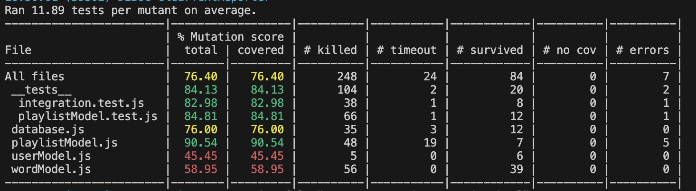

# Лабораторна робота №6: Тестування програмного забезпечення

## Зміст
1. [Покриття модуля Unit-тестами](#1-покриття-модуля-unit-тестами)
2. [Інтеграційне тестування](#2-інтеграційне-тестування)
3. [E2E тестування (End-to-End)](#3-e2e-тестування-end-to-end)
4. [Мутаційне тестування](#4-мутаційне-тестування)
5. [Висновок](#5-висновок)
6. [Подальші кроки](#6-подальші-кроки)

---

## 1. Покриття модуля Unit-тестами

**Обов'язкові функції та результати:**

- Модуль: **`playlistModel.js`**
- **Файл тестів:** [playlistModel.test.js](../../db/__tests__/playlistModel.test.js)

### Перевірені функції:
1. `addPlaylist` – додавання плейлиста.
2. `getPlaylistsByUserId` – отримання плейлистів користувача.
3. `getPlaylistById` – отримання плейлиста за ID.
4. `deletePlaylistById` – видалення плейлиста за ID.
5. `updatePlaylistOpenTime` – оновлення часу останнього відкриття.

> Результат: Тести успішно покривают сценарії роботи модуля.

---

## 2. Інтеграційне тестування

### **Протестовані маршрути:**
- **POST** `/playlists` – створення плейлиста.
- **GET** `/playlists` – отримання усіх плейлистів.
- **DELETE** `/playlists/:id` – видалення плейлиста.
- **PUT** `/playlists/open/:id` – оновлення часу.

### **Файл тестів:** [integration.test.js](../../db/__tests__/integration.test.js)

**Приклад запуску:**
```javascript
beforeAll(() => {
    initDatabase();
    server.listen(5001);
});
```
---

## 3. E2E тестування (End-to-End)

**Інструмент**: **Cypress**

### **Конфігурація**:
- [cypress.config.js](../../../lingo-frontend/cypress.config.js)
- **E2E-тести:** [playlists.cy.js](../../../lingo-frontend/cypress/e2e/playlists.cy.js)

### **Сценарії:**
1. **Логін** та редірект.
2. **Створення** нового плейлиста.
3. **Отримання** створеного плейлиста.

> **Деталі:**
```javascript
beforeEach(() => {
  cy.visit('http://localhost:3000/signin');
  cy.get('input[name="login"]').type('admin');
  cy.get('input[name="password"]').type('123456');
  cy.get('button[type="submit"]').click();
  cy.url().should('include', '/library');
});
```

---

## 4. Мутаційне тестування

**Інструмент**: **Stryker Mutator**

### **Результат:**
- **Mutation Score:** 76.40%
- **HTML-звіт:** [mutation.html](../../reports/mutation/mutation.html)



**Покриття:**
- `playlistModel.js` – 90.54%
- `userModel.js` – 45.45%

---

## 5. Висновок
1. **Unit-тести** покривают всі призначені функції.
2. **Інтеграція** та **E2E тести** успішно перевірюют проект.

---

## 6. Подальші кроки
1. Покриття Unit-тестами інших моделей.
2. Оптимізація E2E сценаріїв.
3. Покриття **userModel.js** та **wordModel.js**.
