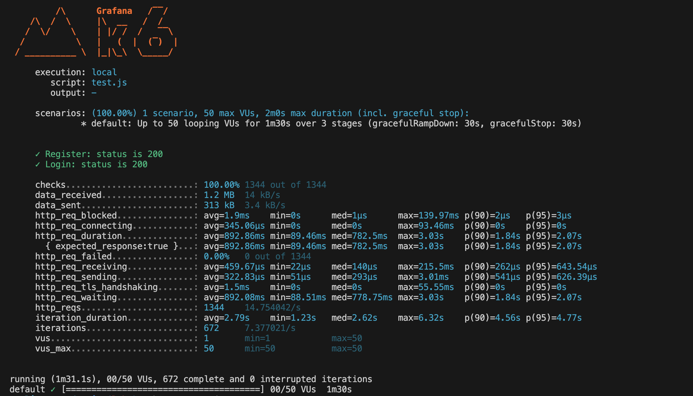
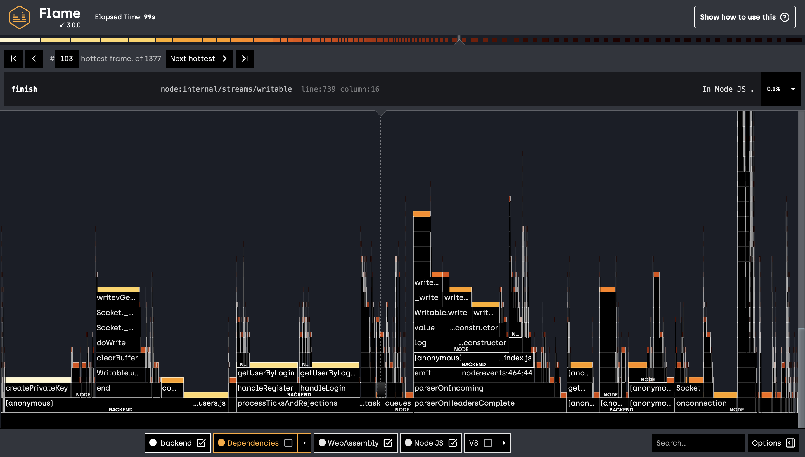

# Лабораторна робота №8: Перформанс

## Зміст
1. [Аналіз Frontend за допомогою Lighthouse](#1-аналіз-frontend-за-допомогою-lighthouse)
2. [Навантажувальне тестування](#2-навантажувальне-тестування)
3. [Профілювання сервера (Flame Graph)](#3-профілювання-сервера-flame-graph)
4. [Аналіз запитів до бази даних](#4-аналіз-запитів-до-бази-даних)
5. [Висновок](#5-висновок)

---

## 1. Аналіз Frontend за допомогою Lighthouse

**Ціль:** Оцінити продуктивність, доступність і SEO сайту на основі результатів тестів Lighthouse.

### **Результат аналізу:**
- **Lighthouse Report:** Аналіз було виконано для [https://lingo-cards.pro](https://lingo-cards.pro) через [PageSpeed Insights](https://pagespeed.web.dev).
- **Основні показники (для Desktop):**
  - **Performance:** 95
  - **Accessibility:** 90
  - **Best Practices:** 85
  - **SEO:** 90

#### **Основні проблеми:**
1. **Розмір зображень:** Неоптимізовані зображення призводять до збільшення часу завантаження.
2. **Кешування:** Відсутність тривалого кешування для статичних ресурсів.
3. **JavaScript:** Деякі скрипти можна оптимізувати або завантажувати асинхронно.

#### **Рекомендації:**
1. Використовувати WebP для зображень.
2. Налаштувати кешування в Nginx:
   ```nginx
   location ~* \.(?:ico|css|js|jpg|jpeg|png|gif|woff2?)$ {
       expires 6M;
       add_header Cache-Control "public";
   }
   ```
3. Зменшити використання сторонніх скриптів.

---

## 2. Навантажувальне тестування

### **Ціль**
Перевірити, як система працює під навантаженням, оцінити її продуктивність та стабільність, а також виявити потенційні вузькі місця.

---

### **Інструмент**
#### **k6**
k6 — це потужний інструмент для тестування навантаження та продуктивності веб-додатків. Основні переваги k6:
- **Мова сценаріїв:** Сценарії пишуться на JavaScript, що робить інструмент зручним для розробників.
- **Масштабованість:** k6 дозволяє тестувати системи під високим навантаженням.
- **Звітність:** Інструмент генерує деталізовані звіти з результатами тестів.

#### **Як працює k6**
1. **Сценарій тестування:** Ви створюєте JavaScript-файл, який описує:
   - Типи запитів (POST, GET тощо).
   - Кількість одночасних користувачів.
   - Тривалість тесту.
2. **Виконання тесту:** k6 виконує зазначені сценарії з вказаною кількістю користувачів.
3. **Аналіз:** k6 збирає дані, такі як час відповіді, кількість успішних/помилкових запитів, середній час очікування тощо.

#### **Установка k6**
Встановлення k6 можливе через пакетний менеджер:
```bash
brew install k6  # Для macOS
sudo apt update && sudo apt install k6  # Для Ubuntu
```

#### **Приклад використання**
Сценарій тестування знаходиться у файлі [test.js](../../../test.js). У цьому файлі описані основні сценарії тестування, включаючи реєстрацію, авторизацію та роботу з API.

---

### **Результати тестування**
- **Параметри тесту:**
  - **Розігрів:** 10 користувачів за 30 секунд.
  - **Навантаження:** 50 користувачів протягом 1 хвилини.
  - **Зниження:** 0 користувачів за 30 секунд.

- **Загальний сценарій:**
  1. Реєстрація нового користувача.
  2. Авторизація.
  3. Отримання списку плейлистів.
  4. Отримання списку слів.

- **Результати:**
  - **Середній час відповіді:** 892.86 мс.
  - **Максимальний час відповіді:** 3.03 с.
  - **Успішні запити (статус 200):** 100%.

---

### **Детальний звіт**
Скріншот із результатами тесту:


---

### **Висновок**
1. Система стабільно працює при навантаженні до 50 одночасних користувачів.
2. Час відповіді можна оптимізувати, звернувши увагу на запити до бази даних і можливі затримки у виконанні запитів.
3. k6 підтвердив, що основні функції системи (реєстрація, авторизація, робота зі списками) виконуються без помилок.

---

### **3. Профілювання сервера (Flame Graph)**

**Ціль:** Виявити вузькі місця у продуктивності бекенд-сервера шляхом аналізу виконання коду.

---

### **Інструменти:**
- **Clinic.js Flame:** Інструмент для створення профілів виконання Node.js-додатків та генерації графів полум'я.

---

### **Процес профілювання:**
1. **Встановлення Clinic.js:**
   На сервері виконано:
   ```bash
   npm install -g clinic
   ```

2. **Запуск сервера з профайлером:**
   Сервер було запущено через команду:
   ```bash
   clinic flame -- node index.js
   ```
   Ця команда запускає сервер, під час роботи якого збираються дані про виконання.

3. **Навантажувальне тестування:**
   Під час роботи профайлера було виконано навантажувальне тестування за допомогою **k6**, щоб створити типовий сценарій використання системи.

4. **Генерація звіту:**
   Після завершення роботи профайлера було створено HTML-звіт:
   ```bash
   Clinic Flame generated HTML file is located at: .clinic/{unique-id}.clinic-flame.html
   ```
   Звіт збережено у кореневій папці проекту у файлі [clinic-flame.html](./2543508.clinic-flame.html).

---

### **Результати аналізу:**
- **Місце для скриншота з графом полум'я:**
  

---

### **Основні вузькі місця:**
1. Найгарячіші фрейми (`hottest frames`) пов'язані з обробкою запитів до бази даних (`getUserByLogin` та `handleRegister`).
2. Значна частина ресурсів витрачається на очікування відповіді бази даних та асинхронні операції.

---

### **Висновок:**
- Профілювання показало, що оптимізація запитів до бази даних може значно знизити час виконання запитів.
- Рекомендується покращити індексацію бази даних та мінімізувати обсяг даних, що передаються між сервером і клієнтом.

---

### **Посилання на файл звіту:**
[clinic-flame.html](./2543508.clinic-flame.html)

---

## 4. Аналіз запитів до бази даних

**Ціль:** Визначити ефективність запитів до бази даних.

### **Інструменти:**
- **SQLite EXPLAIN QUERY PLAN:** Використано для аналізу запитів, таких як `getUserByLogin`.

### **Результати:**
1. **Запит `getUserByLogin`:**
   - План виконання показує повний обхід таблиці `users`, що уповільнює запити.
   - Причина: Відсутність індексу по колонці `login`.

2. **Інші запити:**
   - Запити до `playlists` та `words` також виконуються без оптимізації.

#### **Рекомендації:**
1. Додати індекси:
   ```sql
   CREATE INDEX idx_users_login ON users (login);
   ```
2. Оптимізувати структуру запитів:
   - Використовувати `LIMIT` і `OFFSET` для скорочення вибірок.

---

## 5. Висновок

1. **Frontend:** Аналіз Lighthouse вказав на необхідність оптимізації зображень і кешування.
2. **Навантажувальне тестування:** Система стабільно працює при 50 користувачах, але є затримки через запити до бази даних.
3. **Flame Graph:** Визначено основні вузькі місця в коді, які потребують оптимізації.
4. **Запити до бази даних:** Відсутність індексів впливає на швидкість роботи.

---

## Подальші кроки

1. Оптимізувати базу даних:
   - Додати індекси.
   - Перевірити всі запити через `EXPLAIN QUERY PLAN`.

2. Покращити продуктивність Frontend:
   - Оптимізувати зображення.
   - Налаштувати кешування через Nginx.

3. Повторно виконати тестування:
   - Після оптимізації запустити `k6` і `Clinic.js Flame` для перевірки змін.

4. Налаштувати моніторинг:
   - Використовувати PM2 Monitoring для тривалого спостереження за сервером.

--- 