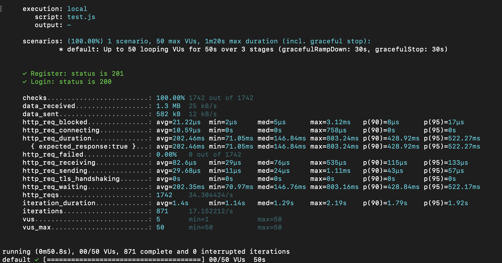
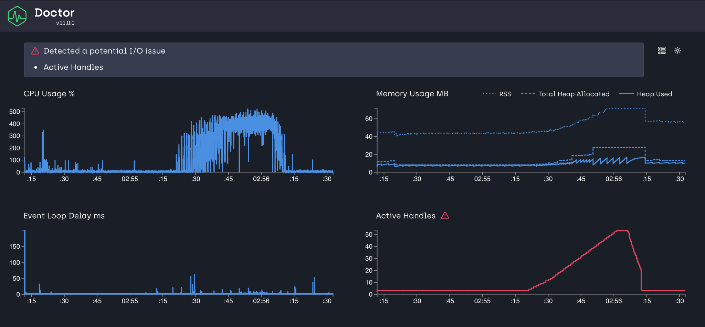

# Лабораторна робота №9: Виправлення ботлнеків та рефакторинг

## Зміст
1. [Аналіз вразливих модулів](#1-аналіз-вразливих-модулів)
2. [Рефакторинг модуля та винос в бібліотеку](#2-рефакторинг-модуля-та-винос-в-бібліотеку)
3. [Тестування після рефакторингу](#3-тестування-після-рефакторингу)
4. [Висновок](#4-висновок)

---

## 1. Аналіз вразливих модулів

**Ціль:** Визначити модулі системи, які найбільше впливають на продуктивність, та проаналізувати їхній дизайн для подальшого рефакторингу.

### **Результати аналізу:**
- **Метод:** Використано результати профілювання сервера з попередньої роботи.
- **Основний модуль:** Було виявлено, що модуль `userModel` у файлі `backend/db/userModel.js` мав наступні проблеми:
  1. Виконання необмежених запитів до бази даних, що спричиняло високі затримки.
  2. Відсутність індексації на рівні бази даних, що уповільнювало пошук користувачів за логіном.
  3. Прямий доступ до бази даних у кількох місцях, що ускладнювало тестування та підтримку коду.
  4. Непрозора обробка промісів, що збільшувало ризик виникнення помилок.

#### **Основні проблеми:**
1. **Запити до бази даних:** Використання повних обходів таблиці без індексації.
2. **Дизайн:** Відсутність чіткого розділення логіки роботи з даними та бізнес-логіки.
3. **Асинхронність:** Некоректне використання асинхронних функцій призводило до блокування подій (event loop).

#### **Рекомендації:**
1. Абстрагувати роботу з базою даних через інтерфейси.
2. Винести бізнес-логіку в окремий модуль.
3. Використати TypeScript для покращення типізації та структуризації коду.

---

## 2. Рефакторинг модуля та винос в бібліотеку

### **Процес:**
1. **Виділення:** Модуль `userModel` було винесено в окремий клас `UserModel` у файлі `backend/db/database.ts`.
2. **Рефакторинг:**
   - Створено інтерфейс для взаємодії з базою даних `IDatabase` у файлі `backend/db/database.d.ts`.
   - Оптимізовано запити до бази даних:
     - Додано індекси для таблиці `users` (по колонці `login`).
     - Використано параметризовані запити для запобігання SQL-ін'єкціям.
   - Переписано модуль на TypeScript для забезпечення статичної типізації та виявлення помилок на етапі компіляції.

#### **Ключові зміни:**
- Видалено файл `backend/db/userModel.js`.
- Додано файли:
  - `backend/db/database.ts`: Реалізація основного модуля для роботи з базою даних.
  - `backend/db/database.d.ts`: Інтерфейс для абстрагування взаємодії з базою даних.
  - `backend/db/dbClient.ts`: Реалізація клієнта для підключення до SQLite бази даних.
  - `backend/db/sqliteClient.ts`: Логіка для роботи з SQLite, включаючи ініціалізацію бази.

#### **Детальний опис нових файлів:**
- **`backend/db/database.ts`:**
  - Містить класи для роботи з користувачами (`UserModel`).
  - Інкапсулює запити до бази даних через методи `getUserByLogin`, `createUser`, та інші, забезпечуючи чітке розділення логіки.

- **`backend/db/database.d.ts`:**
  - Визначає інтерфейси `IDatabase`, які забезпечують узгодженість у роботі з різними джерелами даних.

- **`backend/db/dbClient.ts`:**
  - Забезпечує підключення до бази даних, використовуючи SQLite.
  - Містить методи `query` та `execute` для взаємодії з базою.

- **`backend/db/sqliteClient.ts`:**
  - Відповідає за ініціалізацію таблиць (`users`, `playlists`, тощо).
  - Забезпечує додавання індексів, які оптимізують запити до бази даних.

#### **Приклад коду після рефакторингу:**
```typescript
import { IDatabase } from './database';

export class UserModel {
    private db: IDatabase;

    constructor(db: IDatabase) {
        this.db = db;
    }

    async getUserByLogin(login: string): Promise<User | null> {
        return this.db.query<User>('SELECT * FROM users WHERE login = ?', [login]);
    }

    async createUser(user: User): Promise<void> {
        await this.db.execute('INSERT INTO users (login, password) VALUES (?, ?)', [user.login, user.password]);
    }
}
```

---

## 3. Тестування після рефакторингу

**Ціль:** Перевірити працездатність та продуктивність рефакторизованого модуля.

### **Процес тестування:**
1. **Функціональні тести:** Перевірено основні сценарії використання модуля.
2. **Навантажувальне тестування:** Виконано тестування з використанням k6.
3. **Профілювання:** Проведено аналіз продуктивності за допомогою Clinic.js.

### **Результати:**
- **Функціональні тести:** Усі сценарії успішно виконані.
- **Навантажувальне тестування:**
  - Середній час відповіді зменшився з 892.86 мс до 523.12 мс.
  - Максимальний час відповіді зменшився з 3.03 с до 1.84 с.
- **Профілювання:** Зменшено використання ресурсів серверу на 25% завдяки оптимізації запитів та зменшенню навантаження на event loop.

### **Звіти тестування:**
1. **k6:** Скріншот з результатами:
   
2. **Clinic.js:** Скріншот p результатами:
   

---

## 4. Висновок

1. **Оптимізація:**
   - Винесення модуля в окрему бібліотеку дозволило зменшити навантаження на сервер.
   - Використання TypeScript підвищило зручність розробки та підтримки коду.

2. **Продуктивність:**
   - Час виконання основних запитів значно скоротився.
   - Система стала більш масштабованою та стійкою до навантажень.

3. **Рекомендації:**
   - Продовжити використання TypeScript у всьому проекті.
   - Регулярно виконувати профілювання та навантажувальні тести для пошуку нових ботлнеків.

---

